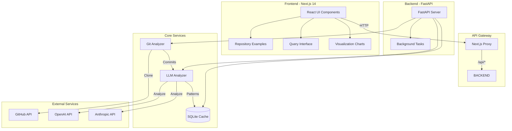

# CodeTime Navigator Architecture

## System Overview

CodeTime Navigator is a full-stack application that analyzes git repositories to reveal code evolution patterns through AI-powered semantic understanding. The system combines repository mining, intelligent analysis, and interactive visualization.

## Architecture Diagram



## Component Architecture

### Frontend (Next.js 14 + TypeScript)

```
frontend/
├── src/
│   ├── app/                 # Next.js App Router
│   │   ├── page.tsx         # Main application page
│   │   ├── layout.tsx       # Root layout
│   │   └── globals.css      # Global styles
│   ├── components/          # React Components
│   │   ├── RepositoryInput.tsx     # URL input & validation
│   │   ├── RepositoryExamples.tsx  # Curated examples gallery
│   │   ├── AnalysisResults.tsx     # Charts & visualizations
│   │   ├── QueryInterface.tsx      # Natural language Q&A
│   │   └── LoadingSpinner.tsx      # Loading states
│   └── data/
│       └── repositoryExamples.ts   # Example repos data
```

**Key Technologies:**
- **Next.js 14**: App Router for modern React patterns
- **TypeScript**: Type safety and better DX
- **Recharts**: Data visualization library
- **Tailwind CSS**: Utility-first styling
- **Axios**: HTTP client for API calls

### Backend (FastAPI + Python)

```
backend/
├── main.py                  # FastAPI application & routes
├── services/
│   ├── git_analyzer.py     # Repository cloning & analysis
│   ├── llm_analyzer.py     # AI-powered pattern detection
│   └── database.py         # SQLite caching layer
└── requirements.txt        # Python dependencies
```

**Key Technologies:**
- **FastAPI**: High-performance async web framework
- **GitPython**: Repository manipulation
- **OpenAI/Anthropic SDKs**: LLM integration
- **SQLite**: Lightweight analysis caching
- **Uvicorn**: ASGI server

## Data Flow

### 1. Repository Analysis Flow

```
User Input → Validate URL → Clone Repository → Extract Commits
    ↓                                              ↓
    ↓                                     Categorize Commits
    ↓                                              ↓
Background Task ← Start Analysis         Detect Patterns
    ↓                                              ↓
Poll Status → Complete → Store in Cache → Return Results
```

### 2. Query Processing Flow

```
Natural Language Query → Retrieve Cached Analysis
            ↓                      ↓
    Filter Relevant Data    Context Preparation
            ↓                      ↓
    LLM Processing ← Combine → Format Prompt
            ↓
    Parse Response → Extract Evidence/Timeline/Insights
            ↓
    Return Structured Answer
```

## Core Algorithms

### 1. Commit Categorization (Optimized)

```python
# Fast heuristic-based categorization
def categorize_commit(message, files):
    categories = {
        'bugfix': ['fix', 'bug', 'error', 'issue'],
        'feature': ['feat', 'add', 'new', 'implement'],
        'refactor': ['refactor', 'restructure', 'cleanup'],
        # ... more categories
    }
    
    # Keyword matching for speed
    for category, keywords in categories.items():
        if any(word in message.lower() for word in keywords):
            return category
    
    return 'unknown'
```

### 2. Relevance Scoring

```python
# Score commits based on query relevance
def score_relevance(query, commit):
    score = 0
    query_words = query.lower().split()
    
    for word in query_words:
        if word in commit.message.lower():
            score += 3  # High weight for message matches
        if word in commit.category:
            score += 2  # Medium weight for category
        if word in commit.files:
            score += 1  # Low weight for file matches
    
    return score
```

### 3. Pattern Detection

```python
# Identify architectural patterns using LLM
async def detect_patterns(commits):
    # Filter architectural commits
    arch_commits = filter(
        lambda c: c.category in ['architecture', 'refactor'],
        commits
    )
    
    # Batch process with LLM
    patterns = await llm.analyze(arch_commits)
    
    return patterns
```

## Performance Optimizations

### 1. Repository Cloning
- **Shallow clones**: Only fetch needed depth (max 500 commits)
- **Single branch**: Clone only main/master branch
- **File limits**: Process max 100 files to prevent memory issues

### 2. LLM Processing
- **Batch processing**: Group commits for fewer API calls
- **Heuristic pre-filtering**: Use keyword matching before LLM
- **Result caching**: SQLite cache for repeated queries
- **Commit limiting**: Analyze only first 200 commits

### 3. Frontend Performance
- **Lazy loading**: Load examples on demand
- **Debounced inputs**: Prevent excessive API calls
- **Optimistic updates**: Show loading states immediately
- **Data pagination**: Limit displayed results

## Security Considerations

### 1. API Security
- **CORS configuration**: Restrict origins in production
- **Rate limiting**: Prevent API abuse (TODO)
- **Input validation**: Sanitize repository URLs
- **Error handling**: No sensitive data in error messages

### 2. Data Protection
- **API key management**: Environment variables only
- **No credential storage**: Keys never in database
- **Secure cloning**: HTTPS only for repositories
- **Temporary storage**: Clean up cloned repos

### 3. User Privacy
- **No user tracking**: No analytics or cookies
- **Local caching**: Analysis cached locally
- **No data retention**: Temporary files deleted

## Deployment Architecture

### Development
```
Frontend: Next.js Dev Server (Port 3000)
Backend: Uvicorn with --reload (Port 8001)
Database: Local SQLite file
```

### Production (Recommended)
```
Frontend: Vercel / Netlify (Static + SSR)
Backend: Render / Railway (Container)
Database: PostgreSQL / Supabase
Cache: Redis for session data
```

## Scalability Considerations

### Horizontal Scaling
- **Stateless backend**: Can run multiple instances
- **Database pooling**: Connection management
- **Queue system**: Celery for background tasks (future)
- **CDN**: Static assets and API caching

### Vertical Scaling
- **Worker processes**: Multiple Uvicorn workers
- **Async operations**: Non-blocking I/O throughout
- **Memory management**: Streaming for large repos
- **Batch processing**: Efficient LLM usage

## Future Enhancements

### Near-term
1. **Real-time updates**: WebSocket for live analysis progress
2. **Export functionality**: Download analysis as PDF/JSON
3. **Team collaboration**: Share analysis with team members
4. **More visualizations**: Dependency graphs, code ownership

### Long-term
1. **Multi-repo analysis**: Compare evolution across projects
2. **Custom AI models**: Fine-tuned for code understanding
3. **IDE integration**: VS Code extension
4. **CI/CD integration**: Automated evolution tracking

## Technology Stack Summary

### Frontend
- **Framework**: Next.js 14 (React 18)
- **Language**: TypeScript 5
- **Styling**: Tailwind CSS 3
- **Charts**: Recharts
- **HTTP**: Axios
- **Icons**: Lucide React

### Backend
- **Framework**: FastAPI
- **Language**: Python 3.9+
- **Server**: Uvicorn (ASGI)
- **Database**: SQLite (dev) / PostgreSQL (prod)
- **Git**: GitPython
- **AI**: OpenAI & Anthropic SDKs

### Infrastructure
- **Version Control**: Git & GitHub
- **Package Management**: npm (frontend), pip (backend)
- **Environment**: Node.js 18+, Python 3.9+
- **Development**: Hot reload, TypeScript compilation

## API Endpoints

### Core Endpoints

```yaml
POST /analyze
  Description: Start repository analysis
  Body: { repo_url: string, max_commits: number }
  Response: { repo_id: string, status: string }

GET /analysis/{repo_id}
  Description: Get analysis status/results
  Response: { status: string, data: object }

POST /query
  Description: Process natural language query
  Body: { repo_id: string, query: string }
  Response: { answer: string, evidence: array, timeline: array }

GET /visualize/{repo_id}
  Description: Get visualization data
  Response: { timeline: array, heatmap: array, ownership: array }
```

## Development Workflow

1. **Setup Environment**
   ```bash
   # Backend
   cd backend
   pip install -r requirements.txt
   
   # Frontend
   cd frontend
   npm install
   ```

2. **Configure API Keys**
   ```bash
   # backend/.env
   OPENAI_API_KEY=your_key
   ANTHROPIC_API_KEY=your_key
   ```

3. **Start Development**
   ```bash
   ./start-dev.sh  # Starts both servers
   ```

4. **Testing Flow**
   - Use example repositories for quick testing
   - Check browser console for debug output
   - Monitor backend logs for errors

## Monitoring & Debugging

### Frontend Debugging
- Browser DevTools for React components
- Network tab for API calls
- Console logs for data structure inspection

### Backend Debugging
- Uvicorn logs for request/response
- Python print statements for flow tracking
- SQLite browser for cache inspection

### Performance Monitoring
- Lighthouse for frontend performance
- FastAPI metrics endpoint (TODO)
- LLM token usage tracking (TODO)

---

*This architecture document reflects the current state of CodeTime Navigator and will evolve as the project grows.*